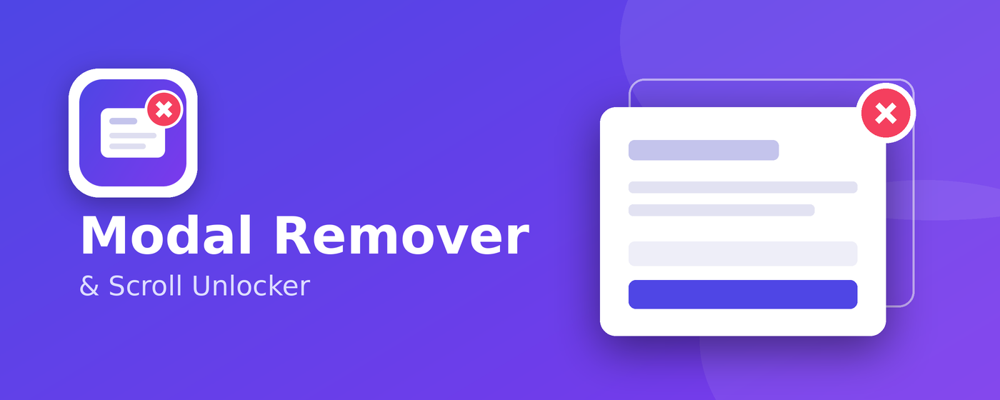

## Modal Remover & Scroll Unlocker

https://chromewebstore.google.com/detail/modal-remover-scroll-unlo/kjbochfncggbiaohfmakiiefhfimepki

### Overview
Remove full-screen pop-ups and overlays and restore page scrolling with one click. On-demand, private, no tracking.

Stuck behind a full-screen pop-up that locks the page? Click the toolbar button and it disappears, and the page scrolls again.

Modal Remover & Scroll Unlocker looks for elements that are fixed or sticky and cover the whole window (newsletter pop-ups, cookie banners, app-install prompts, "sign in to continue" screens) and removes them. It then undoes the scroll lock these overlays commonly leave behind on the page.

HOW TO USE
1. Open a page that is blocked by a full-screen overlay.
2. Click the extension's toolbar icon (pin it from the puzzle-piece menu for quick access).
3. The overlay is removed and scrolling is restored.

PRIVATE BY DESIGN  
• Runs only when you click the button. Nothing runs in the background.  
• Uses the activeTab permission, so it can only act on the tab you clicked on.  
• Collects no data. No analytics, no tracking, no accounts, no network requests.  
• No remote code and no third-party libraries.

GOOD TO KNOW  
• It works on the page in your browser only. If a site withholds content from your browser until you act, removing the overlay will not make that content appear.  
• Some sites use full-screen elements on purpose (video players, web apps). Use the button only when you are blocked by an unwanted overlay; reloading the page brings everything back.  
• Results vary by site, because every site builds its overlays differently.
